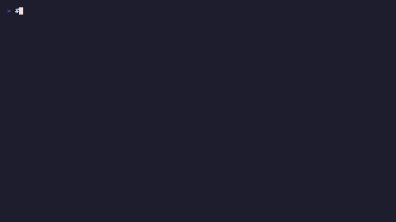

# Dance Hit Audio Signature Matlab Playground

---

A MATLAB learning playground with experiments and exercises.

## Documentation & Proof
- Project narrative: [docs/PROJECT_NARRATIVE.md](docs/PROJECT_NARRATIVE.md)
- CI guard: [.github/workflows/documentation-proof.yml](.github/workflows/documentation-proof.yml)
- This project documentation emphasizes user journey, design methodology, progress, tech stack, key concepts, and implementation evidence.
